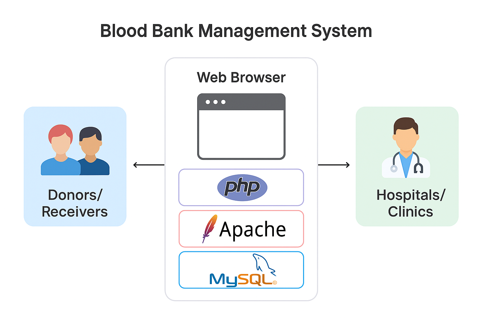

# 🩸 Blood Bank Management System

A web application that acts as a bridge between **hospitals/clinics** and **blood donors/receivers**. It simplifies the process of blood donation, requests, and inventory management.

---

## 🚀 Features

### 👨‍⚕️ For Hospitals/Clinics (Doctors)

- Add blood samples to the blood bank
- Request blood units
- Track the status of requests
- Update hospital details

### 🧑‍🤝‍🧑 For Donors/Receivers

- Register and manage user profile
- Donate or request blood
- Track donation/request history

---

## 💠 Technologies Used

| Layer        | Tools Used                       |
| ------------ | -------------------------------- |
| Frontend     | HTML, CSS, Bootstrap, JavaScript |
| Backend      | PHP                              |
| Database     | MySQL                            |
| DevOps/Infra | Docker, Docker Compose           |

---

## 📦 Requirements

- [Docker](https://docs.docker.com/get-docker/) – Download and install Docker for your OS
- [Docker Compose](https://docs.docker.com/compose/install/) – Install Docker Compose if not bundled with Docker Desktop
- Code Editor (e.g. VS Code, Sublime Text)

---

## 🧪 Getting Started

1. **Clone the repository:**

   ```bash
   git clone https://github.com/Shridharshukl/Blood-Bank-Management-System.git
   cd Blood-Bank-Management-System
   ```

2. **Start the application with Docker Compose:**

   ```bash
   docker-compose up --build
   ```

3. **Access the app:** Open your browser and visit [http://localhost:8000](http://localhost:8000)

---

## 📁 Project Structure

| Folder/File          | Description                                  |
| -------------------- | -------------------------------------------- |
| `css/`               | Frontend stylesheets (CSS)                   |
| `file/`              | Backend PHP logic and database connections   |
| `image/`             | Images used in frontend                      |
| `jastimage/`         | Additional image assets                      |
| `sql/`               | SQL file to auto-import into MySQL container |
| `docker-compose.yml` | Defines Docker services                      |

---

## 📊 Architecture Diagram

<p align="center">
  
</p>

---

## 🔄 How It Works (Process Flow)

1. **User (Donor or Hospital) logs in** via the web interface.
2. **Donors** can donate blood, view donation history, or update profiles.
3. **Hospitals/Clinics** can:
   - Add available blood samples to the system
   - Request blood based on patient needs
   - View the status of their blood requests
4. **PHP** handles request processing and interacts with **MySQL** to retrieve/store data.
5. All content is served via **Apache**, running inside Docker containers.
6. The browser acts as the main interface for interaction between the users and the server.

---

## ❤️ Like this project?

If you found this project helpful, consider giving it a ⭐ on GitHub — it motivates and supports open-source contributions!
